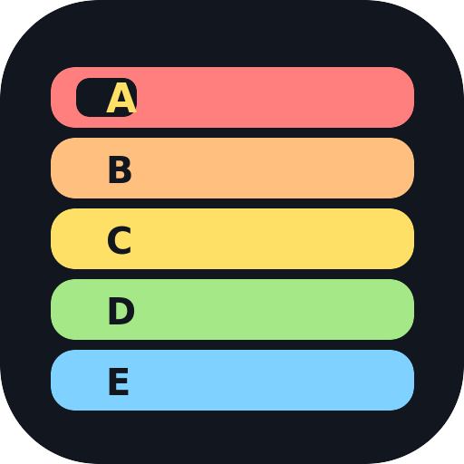

# Tier List Maker

Приложение для Windows: тир-лист с настраиваемыми зонами, шкалами оценки, весами и
автоматическим расчётом баллов. Работает как настольное приложение (Electron) и как
обычная веб-страница (для разработки и предпросмотра).



---

## Возможности

**Элементы**

- Добавление элемента **текстом** или **картинкой** (PNG, JPG, WEBP, GIF, SVG, BMP, AVIF),
  а также быстрыми заготовками: эмодзи и процедурно сгенерированные SVG-картинки.
- `Ctrl+V` вне поля ввода добавляет картинку из буфера; многострочный текст создаёт
  сразу несколько элементов; перетаскивание файлов в окно добавляет картинки, а `.json` — импортирует тир-лист.
- Элементы перетаскиваются мышью между зонами и внутри зоны (с подсветкой места вставки),
  либо переносятся с клавиатуры: `Alt` + `←`/`→` — внутри зоны, `Alt` + `↑`/`↓` — между зонами.
- Клик по элементу открывает карточку рядом с ним: название, баллы по каждой шкале
  (ползунок + число), «заморозка», перенос в зону, удаление.

**Зоны**

- Любое количество зон, по умолчанию 5: `A`, `B`, `C`, `D`, `E`.
- Имя зоны и её числовой диапазон редактируются **кликом по ним** прямо в тир-листе
  (и в боковой панели). Название можно писать любым текстом, включая длинный —
  если текст не влезает, зона **расширяется вниз**, и название переносится на строки.
- Зоны стыкуются: изменение границы сдвигает соседнюю зону.
- **Верхняя зона всегда заканчивается максимумом**, **нижняя — начинается с минимума**
  по текущему набору включённых шкал.
- Диапазоны сохраняются при изменении шкал: пропорциональный пересчёт с фиксацией
  верхней и нижней границ.

**Шкалы оценки**

- У каждой шкалы настраиваются: название, точка отсчёта (`Старт`), точка окончания
  (`Финиш`), шаг и **вес — множитель от 0** (например `0`, `0.5`, `2`, `10`).
- Шкалу можно включить/выключить — из расчёта она исключается, а диапазон баллов
  и границы зон пересчитываются.
- Кнопка **🎯 «Только я»** оставляет включённой одну шкалу, остальные выключает.
- **Заморозка** работает для конкретного элемента: замороженная шкала не меняется
  при ручном перемещении элемента.
- Баллы подтягиваются к сетке шага и не выходят за границы шкалы.

**Расчёт и перемещение**

- Итог элемента считается **опционально**:
  - `Σ Сумма` — сумма баллов со всех включённых шкал с учётом весов;
  - `x̄ Среднее` — среднее по всем включённым шкалам с учётом весов.
- Максимум и минимум баллов зависят только от включённых сейчас шкал
  (вес `0` не даёт вклада; в режиме среднего при нулевой сумме весов веса считаются единичными).
- Элементы внутри зоны **отсортированы слева направо по убыванию баллов**.
- При перемещении элемента баллы включённых, но незамороженных шкал **автоматически
  подстраиваются** так, чтобы положение было обоснованным:
  - если справа в зоне есть элемент — целевой балл равен его баллу (равенство даёт место слева,
    порядок при равенстве задаётся позицией вставки);
  - иначе — берётся минимальный балл зоны;
  - элемент никогда не «перепрыгивает» соседей, а балл не выходит за границы зоны;
  - если все включённые шкалы заморожены, баллы не меняются, а в уведомлении сообщается,
    почему элемент не удалось передвинуть (замороженные шкалы удерживают итог).
- Авто-подстройку можно выключить в статус-баре — тогда элемент просто закрепляется
  в выбранной зоне вручную (кнопка «Снять закрепление» возвращает расчёт по баллам).

**Файлы**

- **Экспорт в JSON** (`Ctrl+S` или кнопка) — в файл попадает и состояние (зоны, шкалы,
  элементы, картинки как data URL), и читаемый отчёт: диапазоны зон, итоги элементов
  и расшифровка вклада каждой шкалы.
- **Импорт из JSON** (`Ctrl+O`, либо перетаскиванием файла в окно) с проверкой формата,
  понятными ошибками и предупреждениями о версии схемы. Некорректный файл не портит текущий тир-лист.
- Автосохранение текущего тир-листа (localStorage) — при перезапуске всё на месте.
- Тема: тёмная и светлая.

---

## Быстрый старт (Windows)

Нужен [Node.js 18+](https://nodejs.org/).

```bash
npm install      # установка зависимостей (скачает Electron)
npm start        # запуск приложения
```

### Сборка установщика

```bash
npm run dist:win            # установщик NSIS + portable-версия в папку release/
npm run dist:win:portable   # только portable .exe
```

Готовые файлы: `release/TierListMaker-Setup-1.0.0.exe` и `release/TierListMaker-Portable-1.0.0.exe`.
Сборка под Windows выполняется лучше всего на Windows (кроссплатформенная сборка NSIS из Linux
требует wine).

### Предпросмотр в браузере (для разработки)

```bash
npm run dev      # http://localhost:5173
```

В браузере файлы сохраняются штатным скачиванием, автосохранение — в localStorage.
Открывать `index.html` напрямую через `file://` нельзя: браузеры блокируют ES-модули
на файловой схеме, поэтому используйте `npm run dev` (в приложении Electron файлы
раздаются через защищённую схему `app://`, там всё работает).

### Тесты

```bash
npm test           # 52 теста: ядро расчётов + интеграционные тесты интерфейса (jsdom)
npm run test:core  # только логика баллов, зон и шкал
npm run test:ui    # только интерфейс
```

---

## Горячие клавиши

| Клавиши | Действие |
| --- | --- |
| `Ctrl+N` | новый тир-лист |
| `Ctrl+O` | импорт из JSON |
| `Ctrl+S` | экспорт в JSON |
| `Ctrl+V` | вставить картинку/текст как элемент (вне поля ввода) |
| `Alt` + `←`/`→` | сдвинуть элемент внутри зоны |
| `Alt` + `↑`/`↓` | перенести элемент в зону выше/ниже |
| `Enter` / `Esc` | подтвердить / отменить правку названия или диапазона |
| `Delete` | удалить выбранный элемент |
| `F2` | перейти к редактированию названия выбранного элемента |

---

## Формат JSON

```jsonc
{
  "schema": "tierlistmaker/1",
  "title": "Мой тир-лист",
  "mode": "sum",                     // "sum" — сумма, "avg" — средний балл
  "autoAdjust": true,
  "scoreRange": { "min": 0, "max": 75 },
  "zones":  [{ "id": "zone-1", "name": "A", "color": "#ff7f7f", "min": 60, "max": 75, "items": [...] }],
  "scales": [{ "id": "sc-quality", "name": "Качество", "min": 0, "max": 10, "step": 1, "weight": 2, "enabled": true }],
  "items":  [{
    "id": "item-1",
    "text": "Меч",
    "image": "data:image/png;base64,…",   // или null
    "scores": { "sc-quality": 8 },
    "frozen": { "sc-quality": true },      // заморозка шкалы для этого элемента
    "total": 16,
    "breakdown": [{ "scale": "Качество", "value": 8, "weight": 2, "contribution": 16, "frozen": true }]
  }],
  "activeScales": ["sc-quality", …]
}
```

При импорте достаточно массивов `zones`, `scales` и `items` — отсутствующие поля
заполняются значениями по умолчанию, а границы зон из файла берутся как есть.

---

## Структура проекта

```
index.html                 разметка окна приложения
electron/main.js           главный процесс: окно, меню, диалоги файлов, схема app://
electron/preload.cjs       мост window.tierlist (изолированный контекст)
src/styles/app.css         оформление (тёмная и светлая темы)
src/js/constants.js        значения по умолчанию, идентификаторы
src/js/scoring.js          логика: баллы, диапазоны, раскладка, авто-подстройка (без DOM)
src/js/store.js            состояние, мутации, подписки, сохранение
src/js/serialize.js        экспорт/импорт JSON
src/js/files.js            файловые операции (Electron / браузер), картинки в data URL
src/js/sample-image.js     генерация картинок-заготовок и эмодзи
src/js/ui/dom.js           хелперы: элементы, тосты, всплывающие карточки, правка «на месте»
src/js/ui/board.js         тир-лист: зоны, элементы, перетаскивание
src/js/ui/zones.js         панель зон и карточка настройки зоны
src/js/ui/scales.js        панель шкал
src/js/ui/itemInspector.js карточка элемента
src/js/app.js              связывание всего, горячие клавиши, файлы
scripts/dev-server.mjs     статический сервер для браузерного предпросмотра
test/scoring.test.mjs      28 тестов логики
test/ui.test.mjs           24 интеграционных теста интерфейса (jsdom)
```

## Заметки

- Картинки хранятся внутри JSON как data URL и автоматически уменьшаются до 512 px,
  чтобы файл оставался компактным.
- Если сеть ограничена (корпоративный прокси, проверка сертификатов), установка Electron
  может упасть на скачивании бинарника. Тогда: `ELECTRON_SKIP_BINARY_DOWNLOAD=1 npm install`
  поставит зависимости без бинарника — приложение запустится после обычной установки
  в сети без ограничений.
- Тир-лист обратно совместим: `schema` и `version` позволяют развивать формат,
  старые файлы читаются с приведением к текущему виду.
